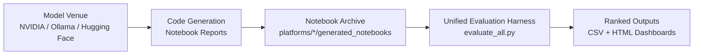

# Jane Street Quant Wars

Cross‑platform LLM quant research bench – 80 committed notebook reports across NVIDIA NIM, Ollama Cloud, and Hugging Face, rescored on the Jane Street Real‑Time Market Data Forecasting challenge. Includes a live institutional dashboard that ranks models by actual forecasting quality.


Institutional-style research bench for testing whether large language models can write signal-bearing forecasting pipelines for the Jane Street Real-Time Market Data Forecasting problem.

This repository is built like a quant research book, not a prompt gallery. Models are asked to produce code, their notebook outputs are preserved, and those notebooks are rescored under a common framework so we can compare actual forecasting quality instead of marketing quality.

## Research Question

Can an LLM produce a compact forecasting pipeline that improves on a naive baseline for `responder_6` under a standardized out-of-sample test?

That question is evaluated across three inference venues:

- NVIDIA NIM
- Ollama Cloud
- Hugging Face

## Current Evaluated Result

The strongest scored result currently saved in this repository is:

| Field | Value |
|------|------|
| Current evaluated leader | `mistralai/mistral-7b-instruct-v0.3` |
| Venue | NVIDIA NIM |
| Best MSE | `0.786110` |
| R2 | `+0.002356` |
| Interpretation | Positive out-of-sample alpha in the saved scoring book |

Important caveat:

All currently available notebook report folders are now committed in-platform, including the NVIDIA archive plus the Hugging Face and Ollama report sets. The current repo-native scoring book covers the committed notebook reports themselves. Models that never produced a notebook report are not part of that ranked book.

## Main Research Presentation

- Main dashboard: [results_dashboard.html](https://htmlpreview.github.io/?https://github.com/gitdhirajsv/Jane-Street-Quant-Wars/blob/master/results_dashboard.html)

This is the single presentation layer for the repo. It combines the saved NVIDIA NIM, Ollama Cloud, and Hugging Face model universe into one institutional-style report.

## What This Repository Does

- Prompts models to write full forecasting pipelines rather than isolated code fragments
- Stores raw notebook outputs as an audit trail of what each model actually produced
- Re-scores generated notebooks under a shared evaluation harness
- Compares models by out-of-sample error and signal quality, not by hype or parameter count
- Preserves platform separation so the research trail stays inspectable

## Software Stack

- `Python` runs the generation scripts, notebook archive handling, and evaluation harness
- `Polars` is the dataframe engine for fast Jane Street data loading and feature work
- `XGBoost` is the primary tabular model family used inside the benchmarked forecasting pipelines
- `scikit-learn` is used for train/test utilities and scoring metrics
- `nbformat` preserves and reads model-generated notebook reports as the audit trail
- `LangChain`, `langchain-nvidia-ai-endpoints`, `langchain-openai`, and `huggingface_hub` connect the repo to NVIDIA NIM, Ollama-compatible endpoints, and Hugging Face inference
- `python-dotenv` manages local credential loading from `.env`
- `Kaggle` is used for Jane Street competition dataset access when needed

## Research Architecture



## Repository Layout

```text
JaneStreet-Quant-Wars/
|-- README.md
|-- SCRIPTS.md
|-- .env.example
|-- requirements.txt
|-- evaluate_all.py
|-- leaderboard.csv
|-- unified_leaderboard.csv
|-- results_dashboard.html
|-- unified_dashboard.html
|-- RESULTS.md
|-- CLAUDE_EVALUATION.md
`-- platforms/
    |-- nvidia/
    |   |-- run_competition.py
    |   |-- executed_notebooks/
    |   `-- generated_notebooks/
    |-- ollama/
    |   |-- run_competition.py
    |   `-- generated_notebooks/
    `-- huggingface/
        |-- run_competition.py
        `-- generated_notebooks/
```

## Environment Setup

Run from the repository root:

```bash
python -m venv .venv
.venv\Scripts\activate
pip install -r requirements.txt
```

Create a local `.env` from `.env.example`:

```env
NVIDIA_API_KEY=
HF_TOKEN=
CLOUD_KEY_1=
CLOUD_KEY_2=
CLOUD_KEY_3=
```

## Run The Research Books

NVIDIA NIM:

```bash
python platforms/nvidia/run_competition.py --parallel
```

Ollama Cloud:

```bash
python platforms/ollama/run_competition.py --parallel
```

Hugging Face:

```bash
python platforms/huggingface/run_competition.py --parallel
```

Each runner writes logs and generated notebooks back into its own platform folder. That structure is deliberate: the repository should preserve what each venue produced.

## Evaluation Policy

Run:

```bash
python evaluate_all.py
```

The evaluator scans:

- `platforms/nvidia/generated_notebooks/`
- `platforms/ollama/generated_notebooks/`
- `platforms/huggingface/generated_notebooks/`

It writes:

- `leaderboard.csv`
- `unified_leaderboard.csv`

If local Jane Street parquet data is missing, the evaluator falls back to synthetic data so the pipeline remains runnable for development.

## Why The Results Matter

- The current best scored model is a 7B Mistral, not the largest model in the field.
- Only a small subset of scored entries produce positive R2.
- The repo captures model behavior through the code they actually wrote, which makes the project useful for both benchmark ranking and feature-engineering pattern review.
- The notebook folders are part of the research record, not clutter.

## Research Notes

- The platform notebook folders are intentionally committed.
- The repository now uses direct Python runners instead of old `.bat` wrappers.
- The dashboards should be read as research artifacts, not product claims.

## Disclaimer

This repository is a model-evaluation and research exercise. It is not investment advice, not a trading recommendation, and not a production execution system.

<div align="center">

Built by [Azalyst](https://github.com/gitdhirajsv) | Azalyst Quant Research

</div>
