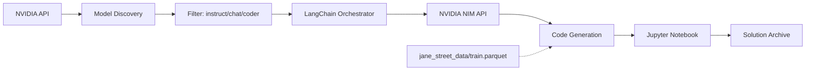

# NVIDIA NIM QUANT WARS

> Multi-Model AI Battle Royale for Jane Street Real-Time Market Data Forecasting

----------------------------------------

## OVERVIEW

**NVIDIA NIM Quant Wars** is an automated competition framework that leverages NVIDIA's official API to discover and execute 200+ NIM models for solving the Jane Street Real-Time Market Data Forecasting challenge. Each model generates Python code using Polars and XGBoost to predict market movements from anonymized financial time series data.

This is a **personal research project** exploring LLM-driven quantitative strategy generation and multi-model evaluation methodologies.

----------------------------------------

## FEATURES

* **Official API Model Discovery** - Fetches verified model IDs directly from NVIDIA API
* **Smart Model Filtering** - Excludes embedding, vision, and rerank models automatically
* **Code Generation Pipeline** - Each model writes complete Python solutions
* **Jupyter Notebook Output** - Clean .ipynb files with model attribution
* **Rate-Limit Safe Execution** - 40 RPM compliant with 2-second delays
* **Polars + XGBoost Stack** - Optimized for large-scale parquet data
* **Virtual Environment Isolation** - One-click setup via batch script

----------------------------------------

## COMPETITION REFERENCE

| Detail | Value |
|--------|-------|
| **Competition** | Jane Street Real-Time Market Data Forecasting |
| **Platform** | Kaggle |
| **Dataset** | 79 anonymized features + 9 responder variables |
| **Objective** | Forecast responder_6 (and other targets) from time series data |
| **Data Type** | Real-world market data from production systems |
| **Link** | https://www.kaggle.com/competitions/jane-street-real-time-market-data-forecasting |

----------------------------------------

## SYSTEM FLOW



----------------------------------------

## INSTALLATION

1. **Clone the repository**
   ```bash
   git clone https://github.com/gitdhirajsv/NVIDIA-NIM-Quant-Wars.git
   cd NVIDIA-NIM-Quant-Wars
   ```

2. **Download Competition Data**
   - Visit: https://www.kaggle.com/competitions/jane-street-real-time-market-data-forecasting/data
   - Download `train.parquet` and place in `jane_street_data/` folder

3. **Set NVIDIA API Key**
   ```bash
   # Option A: Environment variable (recommended)
   setx NVIDIA_API_KEY "your-api-key-here"
   
   # Option B: Edit run_competition.py directly
   ```

4. **Run the Battle**
   ```bash
   # Windows
   start_battle.bat
   
   # Manual (cross-platform)
   python -m venv venv
   venv\Scripts\activate
   pip install langchain langchain-nvidia-ai-endpoints polars xgboost nbformat pandas pyarrow
   python run_competition.py
   ```

----------------------------------------

## CONFIGURATION

| Parameter | Default | Description |
|-----------|---------|-------------|
| **TOP_QUANTILE** | 15% | Threshold for feature engineering |
| **RATE_LIMIT** | 40 RPM | API calls per minute |
| **DELAY** | 2s | Between model calls |
| **TARGET** | responder_6 | Primary prediction variable |
| **FEATURES** | feature_00+ | 79 anonymized market features |

----------------------------------------

## MODEL FILTERING

Models are automatically filtered from NVIDIA's official API:

| **Included** | **Excluded** |
|--------------|--------------|
| instruct     | embed        |
| chat         | rerank       |
| coder        | vision       |
| nemotron     | reward       |
|              | safety       |

**Example Model IDs:**
- `meta/llama-3.3-70b-instruct`
- `nvidia/llama-3.1-nemotron-70b-instruct`
- `mistralai/mixtral-8x22b-instruct-v0.1`
- `codellama/codellama-70b-instruct`

----------------------------------------

## FILE STRUCTURE

```
NVIDIA-NIM-Quant-Wars/
├── run_competition.py          # Main orchestrator script
├── start_battle.bat            # Windows launcher
├── requirements.txt            # Python dependencies
├── jane_street_data/
│   └── train.parquet           # Competition dataset (download separately)
├── venv/                       # Virtual environment (auto-created)
└── *.ipynb                     # Generated solutions (gitignored)
```

----------------------------------------

## USAGE EXAMPLES

**Run full competition:**
```bash
start_battle.bat
```

**Check generated solutions:**
```bash
# After completion, find all notebooks
dir *_solution.ipynb
```

**Open a specific model solution:**
```bash
jupyter meta_llama-3.3-70b-instruct.ipynb
```

----------------------------------------

## OUTPUT EXAMPLE

Each model generates a notebook with:

```python
# Results for model: meta/llama-3.3-70b-instruct

import polars as pl
import xgboost as xgb

# Load data
df = pl.scan_parquet("./jane_street_data/train.parquet")

# Feature engineering: Top 15% quantile
df = df.with_columns(
    pl.col("feature_00").quantile(0.85).alias("top_threshold")
)

# Train XGBoost
model = xgb.XGBRegressor(objective="reg:squarederror")
model.fit(X_train, y_train)
```

----------------------------------------

## TROUBLESHOOTING

| Issue | Solution |
|-------|----------|
| **API Key Error** | Verify NVIDIA_API_KEY is set correctly |
| **No Models Found** | Check API key permissions and network connection |
| **Rate Limit Exceeded** | Increase DELAY value in run_competition.py |
| **Parquet Not Found** | Download data from Kaggle to jane_street_data/ |
| **ImportError** | Run `pip install -r requirements.txt` in venv |
| **404 Model Not Found** | Script now uses official API - should not occur |

----------------------------------------

## LIMITATIONS

* **API Rate Limits** - 40 RPM may slow full competition run (~5+ hours for 200 models)
* **Data Access** - Competition dataset requires Kaggle account
* **Model Variability** - Not all NIM models have equal coding capability
* **No Live Evaluation** - Generated code must be tested separately
* **Research Use Only** - Not production trading infrastructure

----------------------------------------

## ARCHITECTURE NOTES

**Why Polars?**
- Lazy evaluation for large parquet files
- 10-100x faster than pandas for EDA
- Native streaming support

**Why XGBoost?**
- Industry standard for tabular data
- Handles missing values natively
- Proven track record in Kaggle competitions

**Why NVIDIA NIM?**
- 200+ diverse model architectures
- Official API with verified model IDs
- Cost-effective vs individual model APIs
- Automatic model discovery (no CSV needed)

----------------------------------------

## LIVE TRACK RECORD

*This is a framework project. Model solutions are generated locally and not centrally tracked.*

To evaluate solutions:
1. Run generated notebooks against validation data
2. Compare correlation scores on responder_6
3. Track winning models in your own leaderboard

----------------------------------------

## ATTRIBUTION

**Dependencies:**
- [LangChain](https://github.com/langchain-ai/langchain) - LLM orchestration
- [NVIDIA NIM](https://build.nvidia.com/) - Model inference API
- [Polars](https://pola.rs/) - Fast DataFrame library
- [XGBoost](https://xgboost.readthedocs.io/) - Gradient boosting

**Competition:**
- [Jane Street Real-Time Market Data Forecasting](https://www.kaggle.com/competitions/jane-street-real-time-market-data-forecasting) - Kaggle

----------------------------------------

## LICENSE

MIT License - See LICENSE file for details.

----------------------------------------

## DISCLAIMER

**This project is for educational and research purposes only.**

* Not affiliated with Jane Street, NVIDIA, or Kaggle
* Not financial advice or trading recommendations
* Generated code should be reviewed before execution
* Past performance does not guarantee future results
* Use at your own risk

----------------------------------------

## AUTHOR

**Dhiraj **
- GitHub: https://github.com/gitdhirajsv
- More Projects: https://github.com/gitdhirajsv/Azalyst-ETF-Intelligence

----------------------------------------

*Built with passion for systematic research and AI-driven quantitative analysis.*
