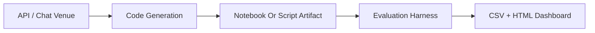

# Jane Street Quant Wars

Cross-platform LLM quant research bench for the Jane Street Real-Time Market Data Forecasting challenge. The repository now tracks two explicit benchmark tracks:

- Archived API notebook reports across NVIDIA NIM, Ollama Cloud, and Hugging Face
- A heavyweight Chat and Agent benchmark covering Claude, DeepSeek-R1, Gemini 3.1, Gemini 3 Flash, GLM-5 Turbo, GPT-5.x, Kimi 2.5, and Qwen 3.5

The dashboard keeps the institutional research presentation styling intact while separating the API LLM leaderboard from the new Chat and Agent leaderboard.


## Research Question

Can an LLM produce a compact forecasting pipeline that improves on a naive baseline for `responder_6` under a controlled out-of-sample test?

That question is currently evaluated across:

- NVIDIA NIM
- Ollama Cloud
- Hugging Face
- Chat and Agent UI runners

## Current Evaluated Results

The benchmark now reports two separate leaderboards.

| Track | Current leader | Venue | MSE | R2 | Interpretation |
|------|------|------|------|------|------|
| API LLM notebook book | `mistralai/mistral-7b-instruct-v0.3` | NVIDIA NIM | `0.786110` | `+0.002356` | Best archived API notebook result in the repository scoring book |
| Chat and Agent heavyweight run | `Claude Sonnet 4.6 Max Reasoning` | Chat and Agent UI | `0.233276` | `+0.704348` | Best live chat-model result from the full-dataset CPU-only run |

Important caveat:

The API leaderboard and the Chat and Agent leaderboard use the same visible MSE and R2 metrics, but they are different evaluation tracks. The API book comes from archived notebook reports rescored under the repository harness. The Chat and Agent run uses the full 20GB dataset with a strict temporal split and CPU-only execution.

## Main Research Presentation

- Main dashboard: [results_dashboard.html](https://htmlpreview.github.io/?https://github.com/gitdhirajsv/Jane-Street-Quant-Wars/blob/master/results_dashboard.html)

The dashboard is the main presentation layer for the repo. It separates:

- Archived API LLM notebook results
- Live Chat and Agent benchmark results

## What This Repository Does

- Prompts models to write full forecasting pipelines rather than isolated code fragments
- Stores raw notebook outputs as an audit trail of what each API venue actually produced
- Re-scores generated API notebooks under a shared evaluation harness
- Runs a separate heavyweight Chat and Agent benchmark on the full dataset under a controlled CPU-only execution pipeline
- Compares models by out-of-sample error and signal quality, not by hype or parameter count
- Preserves platform separation so the research trail stays inspectable

## Heavyweight Chat and Agent Extension

The benchmark now includes the following heavyweight models through direct chat and agent execution:

- Claude Opus (Thinking Model)
- Claude Sonnet 4.6 Max Reasoning
- DeepSeek-R1
- Gemini 3.1 Pro
- Gemini 3.1 Pro (Low)
- Gemini 3 Flash
- GLM-5 Turbo
- GPT 5.2 Extra High Codex
- GPT 5.3 Extra High Codex
- GPT 5.4 Extra High Code
- Kimi 2.5 Agent
- Qwen 3.5

The latest live results are saved in `platforms/chat_agent/agent_leaderboard.csv`, and the sequential runner used for the benchmark is saved in `platforms/chat_agent/run_chat_models.py`.

## Rigorous Full-Dataset Execution Environment

The Chat and Agent extension was run under a stricter execution regime than the archived API notebook book:

- Full Jane Street training dataset at roughly 20GB on disk
- 16GB system RAM with a strict 12GB safe operating ceiling
- Intel Core i5-11260H CPU with 6 cores and 12 threads
- CPU-only XGBoost with `tree_method="hist"`, `device="cpu"`, and `n_jobs=-1`
- Polars lazy scanning with streaming collection
- Float64 to float32 downcasting before materialization
- Aggressive garbage collection immediately after `xgb.DMatrix` creation
- Fully blocking sequential execution between models so RAM is released before the next run begins

## Anti-Leakage Protocol

The full-dataset Chat and Agent benchmark enforced a strict anti-leakage protocol:

- Temporal train and validation splitting by `date_id`
- No future dates allowed into the training fold
- Rolling and batch-derived features kept lag-safe whenever target history was used
- Out-of-sample reporting computed only on the held-out validation dates
- Feature engineering preserved each model's logic while preventing future-data leakage across the time boundary

## Software Stack

- `Python` runs the generation scripts, notebook archive handling, and evaluation harness
- `Polars` is the dataframe engine for fast Jane Street data loading and feature work
- `XGBoost` is the primary tabular model family used inside the benchmarked forecasting pipelines
- `scikit-learn` is used for train/test utilities and scoring metrics
- `nbformat` preserves and reads model-generated notebook reports as the audit trail
- `LangChain`, `langchain-nvidia-ai-endpoints`, `langchain-openai`, and `huggingface_hub` connect the repo to NVIDIA NIM, Ollama-compatible endpoints, and Hugging Face inference
- `python-dotenv` manages local credential loading from `.env`
- `Kaggle` is used for Jane Street competition dataset access when needed

## Research Architecture



## Repository Layout

```text
Jane-Street-Quant-Wars/
|-- README.md
|-- SCRIPTS.md
|-- .env.example
|-- requirements.txt
|-- evaluate_all.py
|-- leaderboard.csv
|-- unified_leaderboard.csv
|-- all_in_one_results.csv
|-- all_in_one_family_winners.csv
|-- results_dashboard.html
|-- unified_dashboard.html
|-- RESULTS.md
|-- CLAUDE_EVALUATION.md
`-- platforms/
    |-- nvidia/
    |   |-- run_competition.py
    |   |-- executed_notebooks/
    |   `-- generated_notebooks/
    |-- ollama/
    |   |-- run_competition.py
    |   `-- generated_notebooks/
    |-- huggingface/
    |   |-- run_competition.py
    |   `-- generated_notebooks/
    `-- chat_agent/
        |-- run_chat_models.py
        `-- agent_leaderboard.csv
```

## Environment Setup

Run from the repository root:

```bash
python -m venv .venv
.venv\Scripts\activate
pip install -r requirements.txt
```

Create a local `.env` from `.env.example`:

```env
NVIDIA_API_KEY=
HF_TOKEN=
CLOUD_KEY_1=
CLOUD_KEY_2=
CLOUD_KEY_3=
```

## Run The Research Books

NVIDIA NIM:

```bash
python platforms/nvidia/run_competition.py --parallel
```

Ollama Cloud:

```bash
python platforms/ollama/run_competition.py --parallel
```

Hugging Face:

```bash
python platforms/huggingface/run_competition.py --parallel
```

Chat and Agent benchmark:

```bash
python platforms/chat_agent/run_chat_models.py
```

## Evaluation Policy

Run:

```bash
python evaluate_all.py
```

The API evaluator scans:

- `platforms/nvidia/generated_notebooks/`
- `platforms/ollama/generated_notebooks/`
- `platforms/huggingface/generated_notebooks/`

The live Chat and Agent run artifacts are stored separately in:

- `platforms/chat_agent/agent_leaderboard.csv`
- `platforms/chat_agent/run_chat_models.py`

It writes:

- `leaderboard.csv`
- `unified_leaderboard.csv`
- `all_in_one_results.csv`
- `all_in_one_family_winners.csv`

## Why The Results Matter

- The best archived API notebook result is a compact 7B Mistral report, not the largest model in the book
- The heavyweight chat-model extension shows how far direct chat execution can move once the runbook is tightened around memory, leakage, and temporal validation
- The repo captures model behavior through the code and notebooks they actually produced, which makes the project useful for both benchmark ranking and feature-engineering pattern review
- The saved notebook folders and chat benchmark outputs are part of the research record, not clutter

## Disclaimer

This repository is a model-evaluation and research exercise. It is not investment advice, not a trading recommendation, and not a production execution system.
